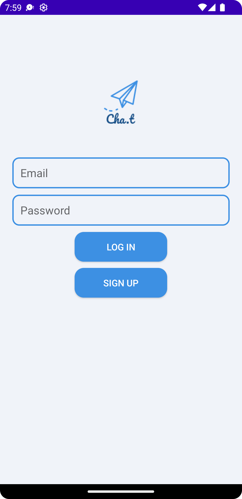
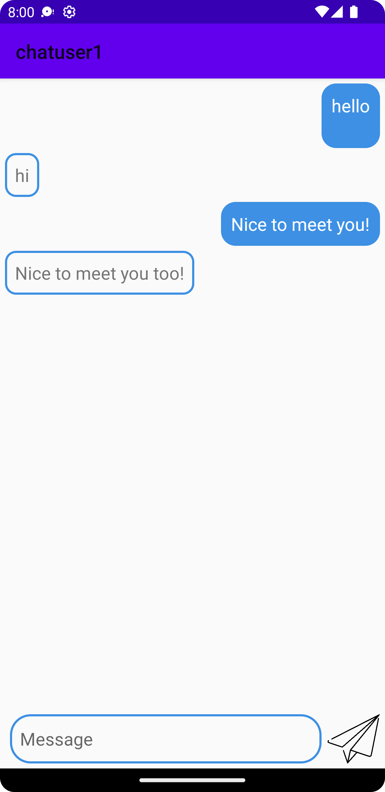

# ChatApp




The ChatApp app is a secure and private chat application for Android, built using the following technologies:

- Programming Language: Kotlin
- Development Environment: Android Studio
- Database: MongoDB

## Features

- Secure and private chat rooms
- Easy and hassle-free username-based login
- Login with email and password
- Forgot password functionality
- Ability to add friends to chat rooms
- Locked rooms with password protection for added privacy
- Anonymous chat rooms for non-judgmental communication

## Description

The ChatApp was developed using Kotlin, a modern programming language for Android app development. It provides a secure and private communication platform for friends to connect and interact with each other. Initially, the app allowed users to join chat rooms by entering a username. However, to enhance security, the app was updated to include a login feature that authenticates users with their email and password.

To develop the app, Android Studio was used as the primary development environment. Android Studio provides a comprehensive set of tools and resources for building robust Android applications. It offers features such as code completion, debugging, and layout design, making the development process efficient and productive.

MongoDB database is used to store and manage user data. MongoDB is a popular NoSQL database that provides flexibility and scalability. It offers document-based storage and powerful querying capabilities, making it suitable for storing chat room data and user information.

The app includes features such as the ability to add friends to chat rooms, creating stronger social connections within the platform. It also supports locked rooms that require a password for entry, ensuring enhanced privacy for specific conversations. Additionally, anonymous chat rooms provide a safe space for users to freely express themselves without fear of judgment.

Thorough testing was conducted to ensure the app's functionality and security. The development team validated the app on different devices and network conditions to guarantee optimal performance. Furthermore, they utilized tools like Firebase Crashlytics to monitor crashes and fix any issues that arose during testing.

Despite the decline in usage over time due to time constraints and competition from other chat apps, the ChatApp serves as an excellent example of building a secure and private chat application using Kotlin, Android Studio, and MongoDB.

## Installation

To install and run the ChatApp locally, follow these steps:

1. Clone the repository:
   ```
   git clone https://github.com/hashiong/ChatApp.git
   ```
2. Open the project in Android Studio.
3. Connect the app to your MongoDB database by following the MongoDB setup instructions.
4. Build and run the app on an Android device or emulator.

## Contributing

Contributions to the ChatApp are welcome! If you have any ideas, improvements, or bug fixes, please submit a pull request. For major changes, please open an issue first to discuss the proposed changes.

## License

The ChatApp is open-source software licensed under the [MIT license](LICENSE). Feel free to use, modify, and distribute this project in accordance with the terms of the license.
